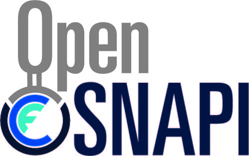

<div align="center">
  <a href="https://www.ucfconsortium.org/projects/opensnapi/"></a>
</div>

Introduction
============

OpenSHMEM-SNAPI is an open source research project based on the [OSSS
OpenSHMEM](https://github.com/openshmem-org/osss-ucx) library implementation.
This software is developed under the [UCF’s Open Smart Network Application
Programming Interface
(OpenSNAPI)](https://www.ucfconsortium.org/projects/opensnapi/) project. It
enables Smart Networking Adapters to provide fast and granular access to large
datasets in order to deliver higher application performance for
latency-sensitive applications and analytic workflows.

The project adds two major components to the OSSS OpenSHMEM implementation.
 * The OpenSNAPI low-overhead persistent storage server is a stand alone component
 based on [Open UCX communication library](https://www.openucx.org).
 * The OpenSHMEM fspace API implements a client for the OpenSNAPI storage server.

The OpenSNAPI storage server tested on Mellanox Bluefield software development
platfrom with NVDIMM-N memory installed. The OpenSHMEM fspace client API was
tested on the Marvell ThunderX2 platform.

* Installation instructions can be found here [contrib](contrib)
* Detailed description of the API and the project are found in the publication.

To reference OpenSHMEM-SNAPI in a publication, please use the following entry:
```bibtex
@inproceedings{shmemio-snapi,
  title={OpenSHMEM I/O Extensions for Fine-grained Access to Persistent Memory Storage},
  author={Megan Grodowitz, Pavel Shamis, Steve Poole},
  booktitle={SMC2020},
  year={2020},
  organization={SMC2020}
}
```

Links
=====

* OpenSHMEM
    * [http://www.openshmem.org/](http://www.openshmem.org/)
* OpenUCX
    * [http://www.openucx.org/](http://www.openucx.org/)
* PMIx
    * [https://pmix.github.io/pmix/](https://pmix.github.io/pmix/)
* Open-MPI
    * [http://www.open-mpi.org/](http://www.open-mpi.org/)

--

* Copyright (c) 2016 - 2018
      * Stony Brook University
* Copyright (c) 2015 - 2018
      * Los Alamos National Security, LLC.
* Copyright (c) 2017 - 2018
      * Rice University.  Neither the name of Rice University nor the names
        of its contributors may be used to endorse or promote products
        derived from this software without specific prior written
        permission.
* Copyright (c) 2011 - 2016
    * University of Houston System and UT-Battelle, LLC.
* Copyright (c) 2009 - 2016
    * Silicon Graphics International Corp.  SHMEM is copyrighted
      by Silicon Graphics International Corp. (SGI) The OpenSHMEM API
      (shmem) is released by Open Source Software Solutions, Inc., under an
      agreement with Silicon Graphics International Corp. (SGI).

All rights reserved.

Redistribution and use in source and binary forms, with or without
modification, are permitted provided that the following conditions
are met:

* Redistributions of source code must retain the above copyright notice,
  this list of conditions and the following disclaimers.

* Redistributions in binary form must reproduce the above copyright
  notice, this list of conditions and the following disclaimer in the
  documentation and/or other materials provided with the distribution.

* Neither the name of Stony Brook University nor the names of its
  contributors may be used to endorse or promote products derived from
  this software without specific prior written permission.

    Neither the name of the University of Houston System, UT-Battelle,
    LLC. nor the names of its contributors may be used to endorse or
    promote products derived from this software without specific prior
    written permission.

    Neither the name of Los Alamos National Security, LLC, Los
    Alamos National Laboratory, LANL, the U.S. Government, nor the names
    of its contributors may be used to endorse or promote products
    derived from this software without specific prior written
    permission.

THIS SOFTWARE IS PROVIDED BY THE COPYRIGHT HOLDERS AND CONTRIBUTORS
"AS IS" AND ANY EXPRESS OR IMPLIED WARRANTIES, INCLUDING, BUT NOT
LIMITED TO, THE IMPLIED WARRANTIES OF MERCHANTABILITY AND FITNESS FOR
A PARTICULAR PURPOSE ARE DISCLAIMED. IN NO EVENT SHALL THE COPYRIGHT
HOLDER OR CONTRIBUTORS BE LIABLE FOR ANY DIRECT, INDIRECT, INCIDENTAL,
SPECIAL, EXEMPLARY, OR CONSEQUENTIAL DAMAGES (INCLUDING, BUT NOT LIMITED
TO, PROCUREMENT OF SUBSTITUTE GOODS OR SERVICES; LOSS OF USE, DATA, OR
PROFITS; OR BUSINESS INTERRUPTION) HOWEVER CAUSED AND ON ANY THEORY OF
LIABILITY, WHETHER IN CONTRACT, STRICT LIABILITY, OR TORT (INCLUDING
NEGLIGENCE OR OTHERWISE) ARISING IN ANY WAY OUT OF THE USE OF THIS
SOFTWARE, EVEN IF ADVISED OF THE POSSIBILITY OF SUCH DAMAGE.
